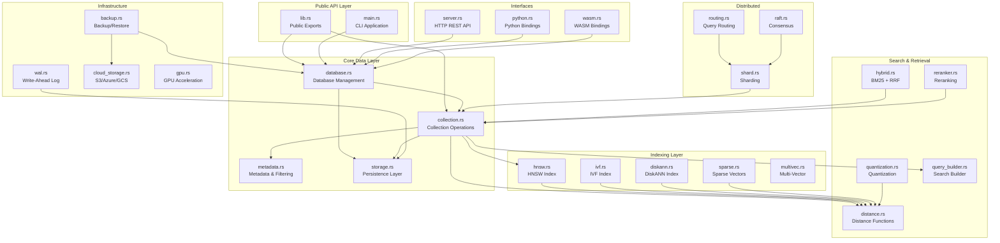
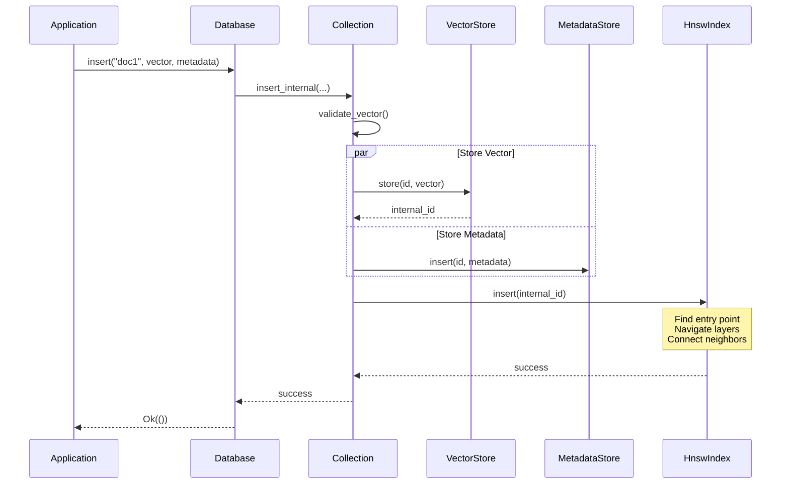
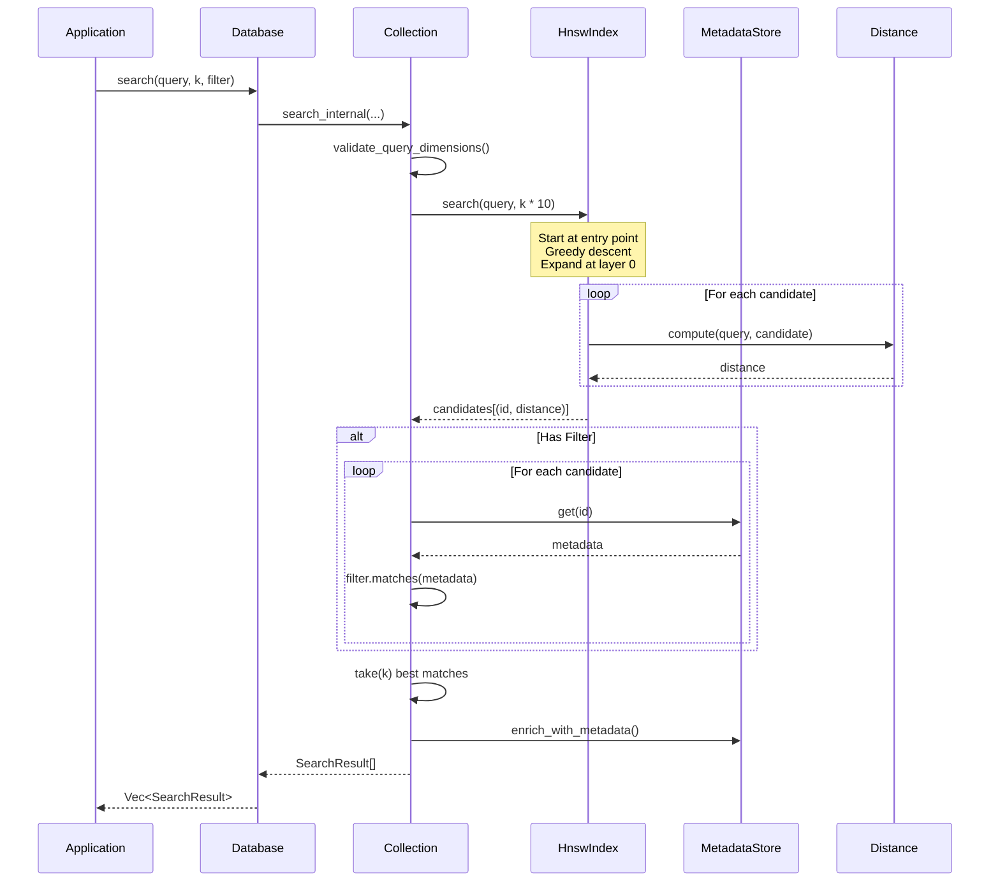
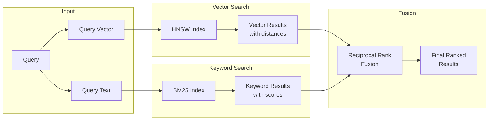
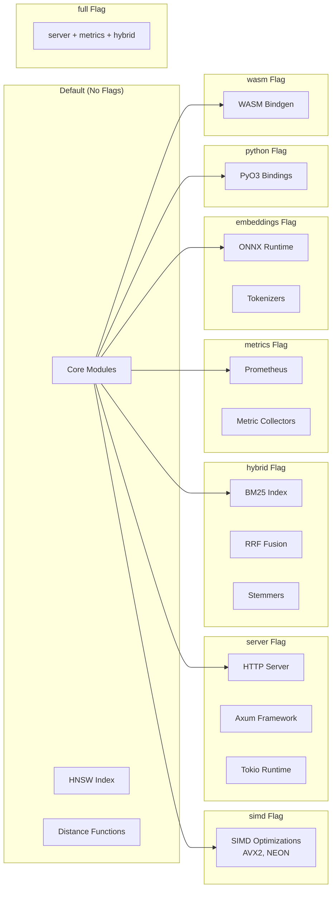

# Needle Architecture

This document describes the internal architecture of Needle, an embedded vector database written in Rust.

## Overview

Needle is designed as "SQLite for vectors" - a single-file, embedded vector database that provides high-performance approximate nearest neighbor (ANN) search with zero configuration.

```
┌─────────────────────────────────────────────────────────────────┐
│                         Application                              │
├─────────────────────────────────────────────────────────────────┤
│                      Needle Public API                           │
│  ┌──────────┐  ┌────────────┐  ┌──────────┐  ┌──────────────┐  │
│  │ Database │  │ Collection │  │  Filter  │  │ SearchResult │  │
│  └──────────┘  └────────────┘  └──────────┘  └──────────────┘  │
├─────────────────────────────────────────────────────────────────┤
│                        Core Components                           │
│  ┌──────────┐  ┌────────────┐  ┌──────────┐  ┌──────────────┐  │
│  │   HNSW   │  │  Metadata  │  │ Storage  │  │ Quantization │  │
│  │  Index   │  │   Store    │  │  Layer   │  │    Layer     │  │
│  └──────────┘  └────────────┘  └──────────┘  └──────────────┘  │
├─────────────────────────────────────────────────────────────────┤
│                     Distance Functions                           │
│  ┌──────────┐  ┌────────────┐  ┌──────────┐  ┌──────────────┐  │
│  │  Cosine  │  │ Euclidean  │  │   Dot    │  │  Manhattan   │  │
│  │  (SIMD)  │  │   (SIMD)   │  │ (SIMD)   │  │   (SIMD)     │  │
│  └──────────┘  └────────────┘  └──────────┘  └──────────────┘  │
├─────────────────────────────────────────────────────────────────┤
│                      File System / Memory                        │
└─────────────────────────────────────────────────────────────────┘
```

## Module Overview

```
src/
├── lib.rs              # Library entry, re-exports public API
├── main.rs             # CLI application
│
├── Core Data
│   ├── collection.rs   # Collection: vectors + metadata + index
│   ├── database.rs     # Database: multi-collection management
│   ├── storage.rs      # File I/O, mmap, vector storage
│   └── metadata.rs     # Metadata storage and filtering
│
├── Indexing
│   ├── hnsw.rs         # HNSW index implementation
│   ├── ivf.rs          # IVF (Inverted File) index
│   ├── sparse.rs       # Sparse vector inverted index
│   ├── multivec.rs     # Multi-vector (ColBERT) support
│   └── diskann.rs      # DiskANN on-disk index
│
├── Search & Retrieval
│   ├── distance.rs     # Distance functions (Cosine, Euclidean, etc.)
│   ├── quantization.rs # Scalar, Product, Binary quantization
│   ├── hybrid.rs       # BM25 + RRF hybrid search
│   ├── reranker.rs     # Cross-encoder reranking
│   └── query_lang.rs   # NeedleQL query language
│
├── Infrastructure
│   ├── wal.rs          # Write-ahead logging
│   ├── backup.rs       # Backup and restore
│   ├── cloud_storage.rs# S3, Azure, GCS backends
│   └── gpu.rs          # GPU acceleration
│
├── Distributed
│   ├── shard.rs        # Sharding with consistent hashing
│   ├── routing.rs      # Query routing and aggregation
│   ├── raft.rs         # Raft consensus
│   ├── crdt.rs         # CRDT for eventual consistency
│   └── rebalance.rs    # Shard rebalancing
│
├── Enterprise
│   ├── security.rs     # RBAC and audit logging
│   ├── encryption.rs   # Encryption at rest
│   ├── namespace.rs    # Multi-tenancy
│   └── telemetry.rs    # Observability
│
├── ML & Analytics
│   ├── clustering.rs   # K-means, hierarchical clustering
│   ├── anomaly.rs      # Anomaly detection
│   ├── dimreduce.rs    # PCA, random projection
│   ├── drift.rs        # Distribution drift detection
│   └── embeddings.rs   # ONNX embedding inference
│
├── Interfaces
│   ├── server.rs       # HTTP REST API
│   ├── python.rs       # Python bindings
│   ├── wasm.rs         # WASM bindings
│   └── tui.rs          # Terminal UI
│
└── Utilities
    ├── error.rs        # Error types
    ├── tuning.rs       # Auto-tuning HNSW parameters
    ├── profiler.rs     # Query profiling
    └── optimizer.rs    # Query optimization
```

## Core Components

### Database

The `Database` struct is the main entry point. It manages multiple collections and handles persistence.

```rust
pub struct Database {
    collections: RwLock<HashMap<String, Arc<RwLock<Collection>>>>,
    path: Option<PathBuf>,
    config: DatabaseConfig,
    dirty: AtomicBool,
}
```

**Key responsibilities:**
- Collection lifecycle (create, drop, list)
- Persistence (save/load from file)
- Thread-safe access via `CollectionRef`

### Collection

A `Collection` holds vectors, their metadata, and the HNSW index for fast search.

```rust
pub struct Collection {
    name: String,
    dimensions: usize,
    distance: DistanceFunction,
    vectors: VectorStore,
    metadata: MetadataStore,
    index: HnswIndex,
    config: CollectionConfig,
}
```

**Key responsibilities:**
- Vector CRUD operations
- Search with optional filtering
- Index maintenance

### HNSW Index

The Hierarchical Navigable Small World (HNSW) index provides approximate nearest neighbor search with logarithmic time complexity.

```
Layer 2:  [A]─────────────────[D]
           │                   │
Layer 1:  [A]────[B]────[C]───[D]────[E]
           │      │      │     │      │
Layer 0:  [A]─[B]─[C]─[D]─[E]─[F]─[G]─[H]─[I]─[J]
```

**Structure:**
- Multiple layers with decreasing density
- Top layers for coarse navigation
- Bottom layer contains all vectors
- Each node connected to M neighbors

**Parameters:**
| Parameter | Default | Description |
|-----------|---------|-------------|
| `M` | 16 | Max connections per node per layer |
| `M_max_0` | 32 | Max connections at layer 0 |
| `ef_construction` | 200 | Search width during insertion |
| `ef_search` | 50 | Search width during query |
| `ml` | 1/ln(M) | Level generation multiplier |

**Search algorithm:**
1. Start at entry point on top layer
2. Greedily descend through layers
3. At layer 0, expand search with ef_search candidates
4. Return k nearest neighbors

### Metadata Store

Stores and indexes metadata for filtering during search.

```rust
pub struct MetadataStore {
    data: HashMap<VectorId, Value>,
    id_map: HashMap<String, VectorId>,
    reverse_map: HashMap<VectorId, String>,
}
```

**Filter operations:**
- Equality: `{"field": "value"}`
- Comparison: `{"field": {"$gt": 10}}`
- Logical: `{"$and": [...]}`, `{"$or": [...]}`
- Membership: `{"field": {"$in": [...]}}`

### Storage Layer

Handles persistence with optional memory-mapping for large files.

```rust
pub struct VectorStore {
    vectors: Vec<Vec<f32>>,
    deleted: HashSet<VectorId>,
}
```

**File format:**
```
┌────────────────────────────────────────┐
│ Magic Number (8 bytes): "NEEDLE01"     │
├────────────────────────────────────────┤
│ Header                                  │
│  - Version (4 bytes)                   │
│  - Flags (4 bytes)                     │
│  - Collection count (4 bytes)          │
├────────────────────────────────────────┤
│ Collection 1                           │
│  - Name length + name                  │
│  - Dimensions (4 bytes)                │
│  - Vector count (8 bytes)              │
│  - Vectors [f32 × dimensions × count]  │
│  - Metadata (MessagePack)              │
│  - HNSW Index                          │
├────────────────────────────────────────┤
│ Collection 2...                        │
└────────────────────────────────────────┘
```

### Distance Functions

SIMD-optimized distance calculations:

| Function | Formula | Use Case |
|----------|---------|----------|
| Cosine | 1 - (a·b)/(‖a‖‖b‖) | Semantic similarity |
| Euclidean | √Σ(aᵢ-bᵢ)² | Spatial distance |
| Dot Product | -a·b | When vectors are normalized |
| Manhattan | Σ\|aᵢ-bᵢ\| | Sparse vectors |

**SIMD implementations:**
- x86_64: AVX2 (256-bit) and AVX-512
- ARM: NEON (128-bit)
- Fallback: Scalar implementation

### Quantization

Reduces memory usage with minimal accuracy loss:

**Scalar Quantization (SQ8):**
- Maps f32 → u8
- 4x memory reduction
- <1% recall loss

**Product Quantization (PQ):**
- Splits vector into subvectors
- Each subvector → centroid ID
- 16-64x compression

**Binary Quantization:**
- Sign of each dimension → bit
- 32x compression
- Good for candidate generation

### IVF Index

Inverted File Index for large-scale approximate search:

```rust
pub struct IvfIndex {
    centroids: Vec<Vec<f32>>,
    inverted_lists: HashMap<usize, Vec<usize>>,
    config: IvfConfig,
}
```

**Parameters:**
| Parameter | Default | Description |
|-----------|---------|-------------|
| `n_clusters` | 256 | Number of Voronoi cells |
| `n_probe` | 16 | Clusters to search at query time |

### Write-Ahead Log (WAL)

Crash recovery and durability:

```rust
pub struct WalManager {
    log_path: PathBuf,
    current_lsn: AtomicU64,
    entries: RwLock<Vec<WalEntry>>,
}
```

**Operations:**
- `append()` - Write operation to log before applying
- `checkpoint()` - Flush log to main storage
- `recover()` - Replay log after crash

### Cloud Storage

Abstracted storage backends for distributed deployments:

```rust
pub trait StorageBackend: Send + Sync {
    fn get(&self, key: &str) -> Result<Vec<u8>>;
    fn put(&self, key: &str, data: &[u8]) -> Result<()>;
    fn delete(&self, key: &str) -> Result<()>;
    fn list(&self, prefix: &str) -> Result<Vec<String>>;
}
```

**Backends:**
- `S3Backend` - Amazon S3 / MinIO
- `AzureBlobBackend` - Azure Blob Storage
- `GCSBackend` - Google Cloud Storage
- `LocalBackend` - Local filesystem
- `CachedBackend` - Caching wrapper for any backend

### GPU Acceleration

GPU-accelerated distance computation:

```rust
pub struct GpuAccelerator {
    backend: GpuBackend,  // CUDA, OpenCL, or Vulkan
    device: GpuDevice,
    config: GpuConfig,
}
```

**Supported Operations:**
- Batch distance computation
- K-nearest neighbor search
- Quantization training

### Query Language (NeedleQL)

SQL-like query language for complex operations:

```sql
SEARCH "machine learning"
FROM documents
WHERE category = 'tech' AND score > 0.5
LIMIT 10
```

Components:
- `QueryParser` - Tokenizes and parses queries
- `QueryValidator` - Validates query semantics
- `QueryOptimizer` - Optimizes query execution plan
- `QueryExecutor` - Executes optimized queries

## Thread Safety

Needle uses a hierarchical locking strategy:

```
Database (RwLock)
└── Collections (HashMap)
    └── Collection (RwLock via CollectionRef)
        ├── VectorStore (internal sync)
        ├── MetadataStore (internal sync)
        └── HnswIndex (internal sync)
```

**Guarantees:**
- Multiple readers can access simultaneously
- Writers get exclusive access
- No deadlocks (lock ordering enforced)

## Distributed Architecture

For horizontal scaling, Needle supports sharding and replication:

```
┌─────────────────────────────────────────────────────────────┐
│                      Query Router                            │
│  ┌──────────────────────────────────────────────────────┐  │
│  │              Consistent Hash Ring                      │  │
│  │   ┌───┐   ┌───┐   ┌───┐   ┌───┐   ┌───┐   ┌───┐     │  │
│  │   │S0 │───│S1 │───│S2 │───│S3 │───│S0 │───│S1 │     │  │
│  │   └───┘   └───┘   └───┘   └───┘   └───┘   └───┘     │  │
│  └──────────────────────────────────────────────────────┘  │
├─────────────────────────────────────────────────────────────┤
│  Shard 0      Shard 1      Shard 2      Shard 3            │
│  ┌──────┐    ┌──────┐    ┌──────┐    ┌──────┐             │
│  │Needle│    │Needle│    │Needle│    │Needle│             │
│  │ Node │    │ Node │    │ Node │    │ Node │             │
│  └──────┘    └──────┘    └──────┘    └──────┘             │
└─────────────────────────────────────────────────────────────┘
```

### Sharding (`shard.rs`)

```rust
pub struct ShardManager {
    shards: HashMap<ShardId, ShardInfo>,
    hash_ring: ConsistentHashRing,
    config: ShardConfig,
}
```

- Consistent hashing for even distribution
- Virtual nodes for balance
- Automatic rebalancing via `RebalanceCoordinator`

### Query Routing (`routing.rs`)

```rust
pub struct QueryRouter {
    shards: Vec<ShardInfo>,
    load_balancing: LoadBalancing,
    config: RouteConfig,
}
```

- Fan-out queries to relevant shards
- Aggregate and merge results
- Load balancing (round-robin, least-connections, random)

### Replication with Raft (`raft.rs`)

```rust
pub struct RaftNode {
    state: RaftState,
    storage: Box<dyn RaftStorage>,
    peers: Vec<NodeId>,
}
```

- Leader election
- Log replication
- Snapshot support for fast recovery

### CRDT Support (`crdt.rs`)

```rust
pub struct VectorCRDT {
    id: String,
    vector: Vec<f32>,
    hlc: HLC,  // Hybrid Logical Clock
    tombstone: bool,
}
```

- Conflict-free replicated data types
- Eventual consistency without coordination
- Hybrid logical clocks for ordering

## Performance Characteristics

### Time Complexity

| Operation | Average | Worst |
|-----------|---------|-------|
| Insert | O(log N × M × ef) | O(N × M) |
| Search | O(log N × ef) | O(N) |
| Delete | O(1) | O(1) |
| Get by ID | O(1) | O(1) |

### Memory Usage

```
Per vector: dimensions × 4 bytes (f32)
HNSW overhead: ~M × 8 bytes per vector per layer
Metadata: variable (JSON storage)

Example (1M vectors, 384 dimensions, M=16):
- Vectors: 1M × 384 × 4 = 1.5 GB
- HNSW: ~1M × 16 × 8 × 1.5 layers = ~192 MB
- Total: ~1.7 GB
```

### Disk Usage

Similar to memory, plus:
- Collection metadata
- Index serialization overhead (~10%)

## Feature Flags

| Flag | Description |
|------|-------------|
| `simd` | SIMD-optimized distance functions |
| `server` | HTTP REST API server |
| `web-ui` | Web-based admin interface |
| `metrics` | Prometheus metrics |
| `hybrid` | BM25 hybrid search |
| `embeddings` | ONNX embedding inference |
| `embedding-providers` | OpenAI, Cohere, Ollama providers |
| `tui` | Terminal user interface |
| `python` | Python bindings (PyO3) |
| `wasm` | WebAssembly bindings |
| `uniffi-bindings` | Swift/Kotlin bindings |
| `full` | All non-binding features (server + web-ui + metrics + hybrid + embedding-providers) |

## Security Model

### Encryption (`encryption.rs`)

```rust
pub struct VectorEncryptor {
    key_manager: KeyManager,
    config: EncryptionConfig,
}
```

- **Encryption at rest:** ChaCha20-Poly1305 authenticated encryption
- **Key derivation:** HKDF for key expansion
- **Per-vector encryption:** Optional granular encryption

### Access Control (`security.rs`)

```rust
pub struct AccessController {
    roles: HashMap<String, Role>,
    users: HashMap<String, User>,
    grants: Vec<PermissionGrant>,
}
```

- **RBAC:** Role-based access control with hierarchical permissions
- **Resources:** Collections, vectors, metadata
- **Permissions:** Read, Write, Delete, Admin
- **Policy decisions:** Allow, Deny, NotApplicable

### Audit Logging (`security.rs`)

```rust
pub struct AuditLogger {
    backend: Box<dyn AuditLog>,
}
```

- **File-based logging:** JSON audit trail
- **In-memory logging:** For testing
- **Queryable:** Filter by action, resource, time range

### Multi-Tenancy (`namespace.rs`)

```rust
pub struct NamespaceManager {
    namespaces: HashMap<String, Namespace>,
    access_control: AccessControl,
}
```

- **Namespace isolation:** Logical separation of data
- **Tenant configuration:** Per-tenant quotas and settings
- **Access control integration:** Namespace-scoped permissions

## Module Dependency Diagram

The following diagram shows the relationships between Needle's major modules:



## Data Flow Diagrams

### Insert Operation Flow



### Search Operation Flow



### Hybrid Search Flow



## Thread Safety Model

Needle uses a hierarchical locking strategy to ensure thread safety without deadlocks:

```mermaid
flowchart TB
    subgraph "Lock Hierarchy"
        direction TB
        L1[Database RwLock<br/>Level 1 - Coarsest]
        L2[Collection HashMap<br/>Level 2]
        L3[CollectionRef RwLock<br/>Level 3]
        L4[Internal Structures<br/>Level 4 - Finest]

        L1 --> L2 --> L3 --> L4
    end

    subgraph "Access Patterns"
        R1[Multiple Readers<br/>Concurrent Access ✓]
        W1[Single Writer<br/>Exclusive Access]
    end

    subgraph "Operations"
        READ[search()<br/>get()<br/>iter()]
        WRITE[insert()<br/>delete()<br/>update()]
    end

    READ --> R1
    WRITE --> W1
```

### Lock Ordering Rules

1. **Database lock** must be acquired before any **Collection lock**
2. **Read locks** are preferred when no mutation is needed
3. **Write locks** are held for the shortest duration possible
4. **No lock** is held during I/O operations (acquire-release pattern)

### Example: Concurrent Access

```rust
// Multiple threads can search concurrently
let db = Arc::new(Database::open("db.needle")?);

let handles: Vec<_> = (0..4).map(|i| {
    let db = Arc::clone(&db);
    thread::spawn(move || {
        let coll = db.collection("docs").unwrap();
        let query = vec![0.1; 384];
        coll.search(&query, 10)  // Concurrent reads OK
    })
}).collect();

// Writes are serialized automatically
let coll = db.collection("docs")?;
coll.insert("new_doc", &vec![0.1; 384], None)?;  // Exclusive write
```

## Feature Flag Impact

The following diagram shows how feature flags affect which modules are compiled:



### Feature Combinations

| Combination | Use Case | Adds |
|-------------|----------|------|
| `default` | Embedded library | Core only |
| `simd` | Performance | AVX2/NEON distance |
| `server` | HTTP service | REST API, Axum, Tokio |
| `server,metrics` | Production service | + Prometheus |
| `full` | Full-featured service | server + metrics + hybrid |
| `python` | Python integration | PyO3 bindings |
| `wasm` | Browser/Node.js | WASM bindings |

## Error Propagation

Errors flow up through the call stack with rich context:

```mermaid
flowchart BT
    subgraph "User Code"
        APP[Application]
    end

    subgraph "API Layer"
        DB[Database::collection()]
        COLL[CollectionRef::search()]
    end

    subgraph "Core Layer"
        SEARCH[Collection::search_internal()]
        INDEX[HnswIndex::search()]
    end

    subgraph "Error Types"
        E1[NeedleError::CollectionNotFound]
        E2[NeedleError::DimensionMismatch]
        E3[NeedleError::IndexError]
    end

    INDEX -->|"Index issue"| E3
    SEARCH -->|"Dimension check"| E2
    DB -->|"Missing collection"| E1

    E1 --> COLL
    E2 --> COLL
    E3 --> SEARCH --> COLL

    COLL -->|"Result<Vec<SearchResult>>"| APP
```

## Future Considerations

1. **GPU acceleration:** CUDA/OpenCL distance computation
2. **Tiered storage:** Hot/warm/cold data separation
3. **Streaming ingestion:** Real-time vector updates
4. **Federated search:** Cross-cluster queries
