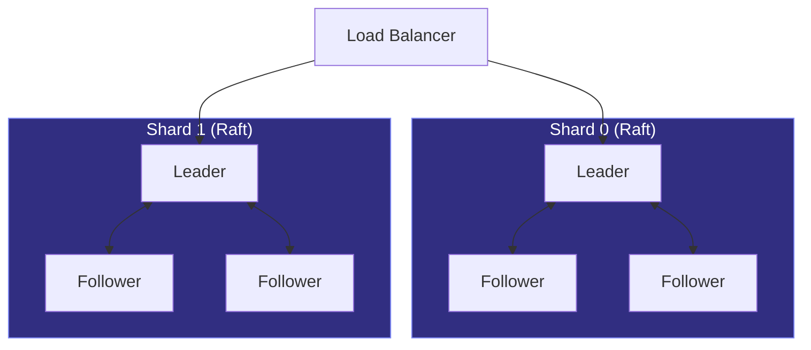
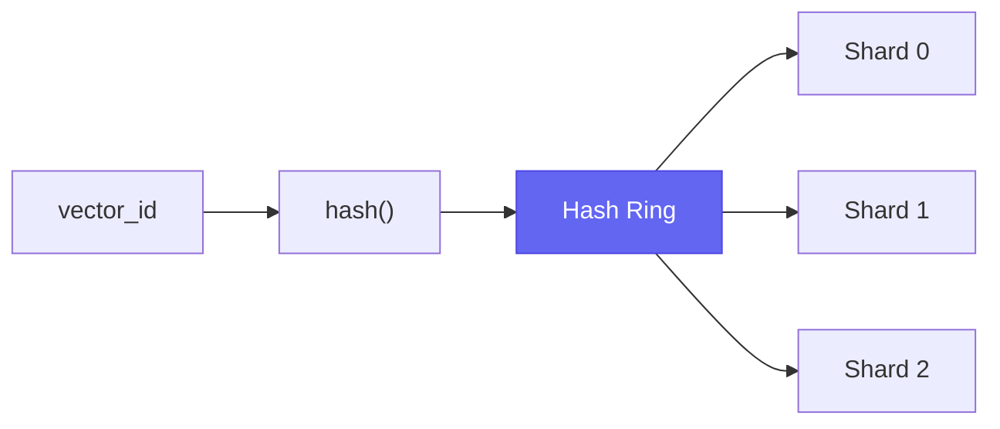

# Distributed Operations

Deploy Needle in distributed configurations with Raft replication and horizontal sharding.

:::info Enterprise Feature
Distributed features (Raft, sharding) are in **Beta**. APIs may change before 1.0. See [API Stability](/docs/api-stability).
:::

---

## Overview

Needle supports two distributed patterns:

1. **Raft Replication** — Strong consistency with automatic leader election (read replicas)
2. **Sharding** — Horizontal partitioning across nodes (scale writes and storage)

These can be combined for both high availability and horizontal scaling.



---

## Raft Replication

### Cluster Topology

| Nodes | Fault Tolerance | Recommended For |
|-------|-----------------|-----------------|
| 3 | 1 failure | Development, small production |
| 5 | 2 failures | Production |
| 7 | 3 failures | High availability |

### Write Path

```
Client → Leader → Log Append → Replicate to Followers → Quorum → Commit → Respond
```

### Read Consistency Options

| Mode | Consistency | Latency | Use Case |
|------|-------------|---------|----------|
| Leader | Strong | Higher | Financial, compliance |
| Follower | Eventual | Lower | Analytics, search |
| Leased | Strong (with lease) | Medium | General purpose |

---

## Horizontal Sharding

### How It Works

Sharding partitions your dataset across multiple nodes using consistent hashing:



### Search Flow

1. Query router receives search request
2. Fan-out to **all** shards in parallel
3. Each shard returns its top-K results
4. Router merges results by distance
5. Returns global top-K

### Cluster Sizing

| Dataset Size | Recommended Shards | Nodes (RF=3) |
|--------------|--------------------|--------------|
| &lt; 10M vectors | 1 | 3 |
| 10M – 100M | 2–4 | 6–12 |
| 100M – 1B | 8–16 | 24–48 |
| &gt; 1B | 16+ | 48+ |

---

## Rebalancing

When adding or removing shards, data must be redistributed:

1. **Preparation**: Mark target ranges as "migrating"
2. **Copy**: Transfer data to new shard (reads still work)
3. **Catch-up**: Replicate changes made during copy
4. **Switch**: Atomic metadata update
5. **Cleanup**: Remove old data

---

## Monitoring

### Key Metrics

| Metric | Description |
|--------|-------------|
| `raft_term` | Current election term |
| `raft_commit_index` | Highest committed log index |
| `raft_replication_lag` | Follower lag behind leader |
| `needle_shard_vector_count` | Vectors per shard |
| `needle_search_fanout_count` | Shards queried per search |

### Alerting

| Condition | Severity | Action |
|-----------|----------|--------|
| Shard has no leader | Critical | Investigate immediately |
| Replication lag &gt; 1s | Warning | Check network/load |
| Replication lag &gt; 10s | Critical | Risk of data loss on failure |
| Shard imbalance &gt; 20% | Warning | Schedule rebalance |

---

## Troubleshooting

### Split Brain

**Symptoms**: Multiple leaders, inconsistent reads

**Resolution**:
1. Identify which partition has quorum
2. Restart nodes in minority partition
3. Verify network connectivity
4. Check NTP synchronization

### Election Failures

**Symptoms**: No leader elected, cluster unavailable

**Resolution**:
1. Verify quorum of nodes are healthy
2. Check network connectivity between all nodes
3. Increase election timeout if network is slow

### Best Practices

- Use an **odd number** of nodes to avoid split-brain
- Place nodes across **availability zones**
- Use a **dedicated network** for Raft communication
- Ensure **low latency** (&lt;10ms) between nodes
- For rolling upgrades: upgrade followers first, step down leader last

---

## See Also

- [Operations Guide](/docs/advanced/operations) — Monitoring, backup, tuning
- [Deployment Guide](/docs/advanced/deployment) — Docker, Kubernetes, Helm
- [Production Checklist](/docs/guides/production-checklist) — Pre-deployment verification
