# Operations Guide

Best practices for running Needle in production, including monitoring, backup/restore, performance tuning, and troubleshooting.

---

## Deployment Architecture

### Single-Node (Recommended Start)

For up to ~10M vectors, a single Needle instance is sufficient:

```mermaid
flowchart TB
    APP[Your Application]
    API["Needle HTTP API<br/>(port 8080)"]
    C1[("Collection: docs")]
    C2[("Collection: images")]
    FILE["📄 vectors.needle"]

    APP --> API
    API --> C1
    API --> C2
    C1 --> FILE
    C2 --> FILE

    style API fill:#6366f1,stroke:#4f46e5,color:#fff
    style FILE fill:#1e293b,stroke:#475569,color:#e2e8f0
```



### Recommended Hardware

| Workload | Vectors | RAM | CPU | Storage |
|----------|---------|-----|-----|---------|
| Small | < 1M | 8 GB | 4 cores | 50 GB SSD |
| Medium | 1–10M | 32 GB | 8 cores | 200 GB NVMe |
| Large | 10–100M | 128 GB | 32 cores | 1 TB NVMe |

---

## Monitoring & Observability

### Prometheus Metrics

Enable metrics with the `metrics` feature:

```bash
cargo run --features "server,metrics" -- serve -a 0.0.0.0:8080 -d vectors.needle
```

#### Key PromQL Queries

```promql
# Search latency (p99)
histogram_quantile(0.99, rate(needle_search_duration_seconds_bucket[5m]))

# Search throughput
rate(needle_search_total[5m])

# Vector count per collection
needle_collection_vector_count{collection="docs"}
```

### Health Checks

```bash
curl http://localhost:8080/health
# {"status": "healthy", "version": "0.1.0"}
```

For Kubernetes:

```yaml
livenessProbe:
  httpGet:
    path: /health
    port: 8080
  initialDelaySeconds: 10
  periodSeconds: 30
readinessProbe:
  httpGet:
    path: /health
    port: 8080
  initialDelaySeconds: 5
  periodSeconds: 10
```

### Alerting Rules

```yaml
groups:
  - name: needle
    rules:
      - alert: NeedleHighSearchLatency
        expr: histogram_quantile(0.99, rate(needle_search_duration_seconds_bucket[5m])) > 0.1
        for: 5m
        labels:
          severity: warning
        annotations:
          summary: "p99 search latency is above 100ms"

      - alert: NeedleHighErrorRate
        expr: rate(needle_errors_total[5m]) > 0.1
        for: 2m
        labels:
          severity: critical
```

---

## Backup and Recovery

### Cold Backup (Simplest)

Needle stores everything in a single file. Just copy it:

```bash
# Stop the server, copy, restart
systemctl stop needle
cp /var/lib/needle/vectors.needle /backup/vectors.needle.$(date +%Y%m%d)
systemctl start needle
```

### Hot Backup (Online)

For a consistent backup without stopping the server:

```rust
db.save()?; // Flush all changes
std::fs::copy("vectors.needle", "backup.needle")?;
```

Via CLI:
```bash
needle compact vectors.needle  # Optional: reclaim space first
cp vectors.needle /backup/$(date +%Y%m%d).needle
```

### Restore

```bash
# Stop the server
systemctl stop needle

# Restore from backup
cp /backup/20250101.needle /var/lib/needle/vectors.needle

# Verify integrity
needle info /var/lib/needle/vectors.needle

# Restart
systemctl start needle
```

### Backup Automation

```bash
# Daily backup at 2 AM
0 2 * * * /usr/local/bin/needle compact /var/lib/needle/vectors.needle && cp /var/lib/needle/vectors.needle /backup/daily/$(date +\%Y\%m\%d).needle

# Weekly cleanup (keep 30 days)
0 4 * * 0 find /backup/daily -mtime +30 -delete
```

---

## Performance Tuning

### HNSW Parameters

| Parameter | Default | Effect |
|-----------|---------|--------|
| `M` | 16 | Connections per layer. Higher = better recall, more memory |
| `ef_construction` | 200 | Build-time search depth. Higher = better index quality |
| `ef_search` | 50 | Query-time search depth. Higher = better recall, slower |

Use auto-tuning for best results:

```rust
use needle::{auto_tune, TuningConstraints, PerformanceProfile};

let constraints = TuningConstraints::new(1_000_000, 384)
    .with_profile(PerformanceProfile::Balanced);
let config = auto_tune(&constraints);
```

### Quantization

| Type | Compression | Recall Impact |
|------|-------------|---------------|
| Scalar (INT8) | 4x | ~2% loss |
| Product (PQ) | 8–32x | ~5% loss |
| Binary | 32x | ~10% loss |

### Query Optimization

```rust
// Profile slow queries
let (results, explain) = collection.search_explain(&query, 10, None)?;
println!("Nodes visited: {}", explain.nodes_visited);
println!("Distance computations: {}", explain.distance_computations);
println!("Total time: {:?}", explain.total_time);
```

### Compaction

After many deletions, compact to reclaim space:

```bash
needle compact vectors.needle
```

**When to compact:**
- Deleted vectors exceed 20% of total
- File size is 2x larger than expected
- Search latency has degraded

---

## Capacity Planning

### Memory Estimation

```
Memory (bytes) ≈ N × (D × 4 + M × 8 × 1.5 + 100)

Where:
  N = number of vectors
  D = dimensions
  M = HNSW M parameter
```

| Vectors | 384 dims, M=16 | With Scalar Quantization |
|---------|-----------------|--------------------------|
| 100K | ~170 MB | ~60 MB |
| 1M | ~1.7 GB | ~600 MB |
| 10M | ~17 GB | ~6 GB |

### Throughput Planning

| Operation | Single Core | 8 Cores (parallel) |
|-----------|-------------|-------------------|
| Search (1M vectors) | ~1,000 QPS | ~6,000 QPS |
| Insert | ~10,000 ops/s | ~50,000 ops/s |

---

## Troubleshooting Runbooks

### High Latency

1. Check `ef_search` — lower it for faster queries
2. Use `search_explain()` to identify bottleneck
3. Check filter selectivity — very broad filters don't help
4. Consider quantization to reduce computation
5. Run compaction if many vectors were deleted

### Memory Issues

1. Enable quantization (Scalar for easy wins)
2. Reduce HNSW `M` parameter
3. Run compaction to reclaim space
4. Check for metadata bloat — store only what you need

### Debug Logging

```bash
# Enable detailed logging
export RUST_LOG=needle=debug
needle serve -d vectors.needle 2>&1 | tee needle.log

# More specific
export RUST_LOG=needle::hnsw=trace,needle::storage=debug
```

---

## Environment Variables

| Variable | Description | Default |
|----------|-------------|---------|
| `RUST_LOG` | Log verbosity | `info` |
| `NEEDLE_DISABLE_MMAP` | Disable memory mapping | `false` |
| `NEEDLE_DATA_DIR` | Data directory | current dir |

---

## See Also

- [Production Checklist](/docs/guides/production-checklist) — Pre-deployment verification
- [Deployment Guide](/docs/advanced/deployment) — Docker, Kubernetes, Helm
- [Distributed Operations](/docs/advanced/distributed) — Sharding and replication
