# API Stability

Needle's public API is organized into three stability tiers to set clear expectations about what may change.

## Tiers

### 🟢 Stable

Core types that most users need. Re-exported at the crate root.

**Includes**: `Database`, `CollectionRef`, `Collection`, `Filter`, `SearchResult`, `HnswIndex`, `DistanceFunction`, `NeedleError`, `Result`, quantizers, sparse vectors, multi-vectors.

**Guarantee**: Breaking changes follow semver. Deprecation warnings appear at least one minor version before removal.

### 🟡 Beta

Feature-complete but may see breaking changes before 1.0.

**Includes**: Backup, encryption, security (RBAC), Raft consensus, sharding, rerankers, query builders.

**Guarantee**: Breaking changes are documented in CHANGELOG.md. We aim for stability but reserve the right to adjust APIs based on feedback.

### 🔴 Experimental

Under active development. Gated behind the `experimental` feature flag.

**Includes**: Agentic memory, GPU acceleration, cloud storage backends, distributed HNSW, plugin systems.

**Guarantee**: None. APIs may change or be removed without notice. Do not depend on these in production without pinning to an exact version.

## Promotion Path

New modules follow this progression:

```mermaid
flowchart LR
    EXP["🔴 Experimental"]
    BETA["🟡 Beta"]
    STABLE["🟢 Stable"]

    EXP -->|"API review +<br/>integration tests"| BETA
    BETA -->|"1+ minor versions<br/>without breaking changes"| STABLE

    style EXP fill:#ef4444,stroke:#dc2626,color:#fff
    style BETA fill:#f59e0b,stroke:#d97706,color:#fff
    style STABLE fill:#22c55e,stroke:#16a34a,color:#fff
```

1. **Experimental**: Added with unit tests. APIs may change freely.
2. **Beta**: Promoted after API review, doc comments on all public items, and integration tests.
3. **Stable**: Promoted after 1+ minor versions in Beta without breaking changes, plus comprehensive doc tests and benchmarks.

## Deprecation Process

1. Add `#[deprecated(since = "X.Y.Z", note = "use new_name instead")]`
2. Document in CHANGELOG.md under "Deprecated"
3. Keep deprecated items for at least one minor version
4. Remove in the next major version

## Feature Flags and Stability

| Feature Flag | Stability | Description |
|-------------|-----------|-------------|
| *(default)* | 🟢 Stable | Core embedded database |
| `simd` | 🟢 Stable | SIMD-optimized distance |
| `server` | 🟢 Stable | HTTP REST API |
| `hybrid` | 🟢 Stable | BM25 + vector hybrid search |
| `metrics` | 🟢 Stable | Prometheus metrics |
| `encryption` | 🟢 Stable | Encryption at rest |
| `diskann` | 🟢 Stable | DiskANN index |
| `integrations` | 🟢 Stable | LangChain / LlamaIndex |
| `embedding-providers` | 🟢 Stable | OpenAI, Cohere, Ollama |
| `embeddings` | 🔴 Unstable | ONNX inference (pre-release dep) |
| `experimental` | 🔴 Experimental | GPU, cloud storage, etc. |

## See Also

- [Feature Flags](/docs/configuration/feature-flags) — Complete feature flag reference
- [Changelog](/docs/changelog) — All notable changes
- [Contributing](/docs/contributing) — How to contribute
