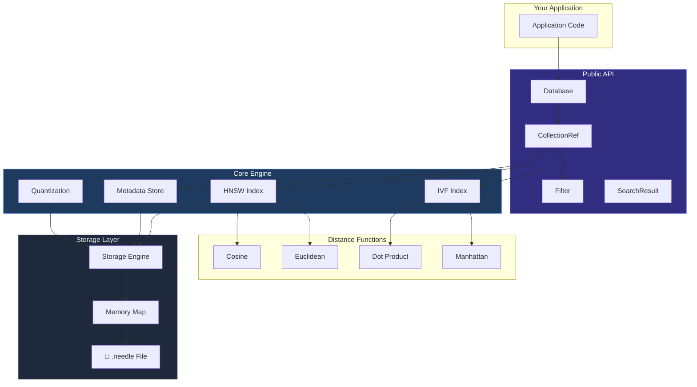
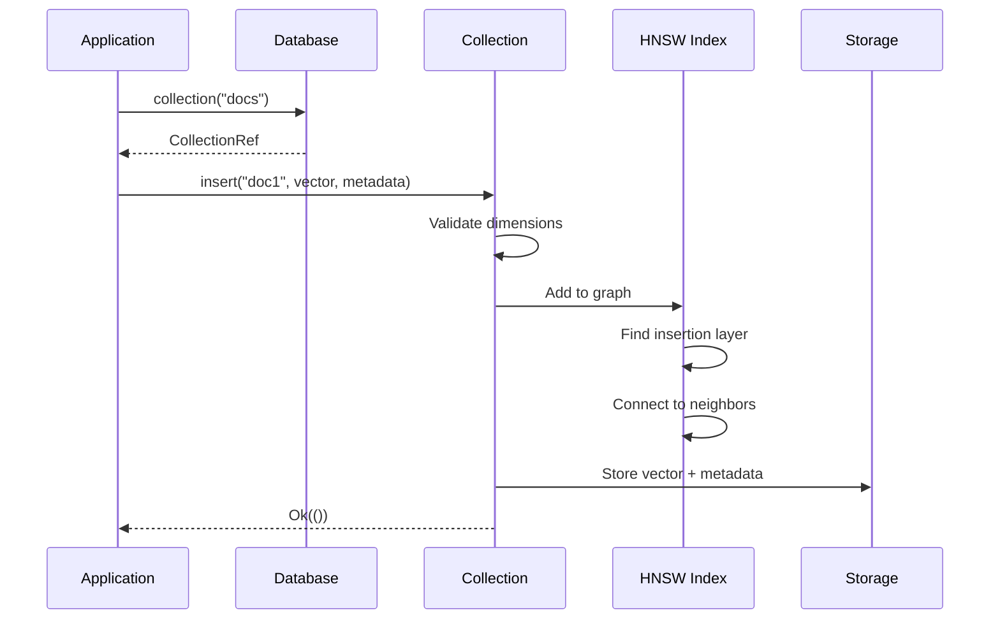
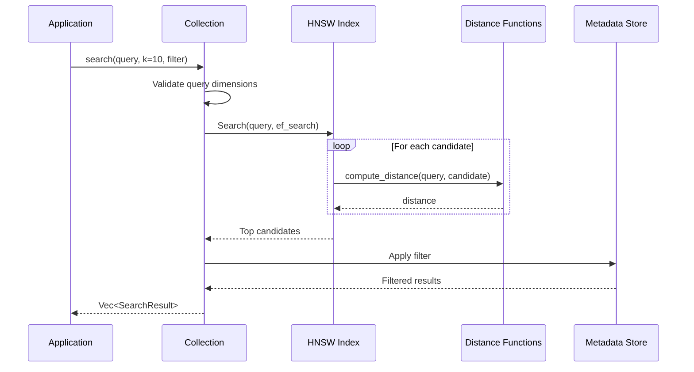

# Architecture

A deep dive into Needle's internal architecture, data flow, and design decisions.

## System Overview

Needle is designed as "SQLite for vectors" — a single-file, embedded vector database with zero configuration.



## Key Types

| Type | Module | Role |
|------|--------|------|
| `Database` | `database/mod.rs` | Entry point. Manages collections, persistence, aliases |
| `Collection` | `collection/mod.rs` | Holds vectors, HNSW index, metadata, search logic |
| `CollectionRef` | `database/collection_ref.rs` | Thread-safe reference (`Arc` + `RwLock`) |
| `HnswIndex` | `indexing/hnsw.rs` | Hierarchical Navigable Small World graph |
| `Filter` | `core/metadata.rs` | MongoDB-style metadata query filters |
| `SearchResult` | `collection/mod.rs` | Result with id, distance, and metadata |
| `NeedleError` | `core/error.rs` | Structured error with error codes |

## Module Map

```
src/
├── lib.rs                  # Library entry, re-exports public API
├── main.rs                 # CLI application
│
├── Core
│   ├── collection/         # Collection: vectors + metadata + index
│   ├── database/           # Database: multi-collection management
│   ├── error.rs            # Error types with structured codes
│   ├── storage.rs          # File I/O, mmap, vector storage
│   └── metadata.rs         # Metadata storage and filtering
│
├── Indexing
│   ├── hnsw.rs             # HNSW index (primary)
│   ├── ivf.rs              # IVF (Inverted File) index
│   ├── diskann.rs          # DiskANN on-disk index
│   ├── sparse.rs           # Sparse vector inverted index
│   └── multivec.rs         # Multi-vector (ColBERT) support
│
├── Search & Retrieval
│   ├── distance.rs         # Distance functions (SIMD-optimized)
│   ├── quantization.rs     # Scalar, Product, Binary quantization
│   ├── hybrid.rs           # BM25 + RRF hybrid search
│   └── reranker.rs         # Cross-encoder reranking
│
├── Interfaces
│   ├── server.rs           # HTTP REST API (feature: server)
│   ├── python.rs           # Python bindings (feature: python)
│   ├── wasm.rs             # WASM bindings (feature: wasm)
│   └── tui.rs              # Terminal UI (feature: tui)
│
├── Enterprise (Beta)
│   ├── encryption.rs       # ChaCha20-Poly1305 encryption at rest
│   ├── security.rs         # RBAC and audit logging
│   ├── wal.rs              # Write-ahead logging
│   ├── raft.rs             # Raft consensus
│   ├── shard.rs            # Consistent hash sharding
│   └── namespace.rs        # Multi-tenancy
│
└── Experimental
    ├── gpu.rs              # GPU acceleration (scaffolding)
    └── cloud_storage/      # S3/GCS/Azure backends (interface only)
```

## Data Flow

### Insert Path



### Search Path



## HNSW Index Design

The HNSW graph is a multi-layer structure where higher layers have fewer nodes and longer-range connections for fast navigation:

```
Layer 2:  [A] ──────────── [B]            (few nodes, long connections)
           │                │
Layer 1:  [A] ── [C] ── [B] ── [D]       (more nodes, medium connections)
           │     │       │      │
Layer 0:  [A]-[E]-[C]-[F]-[B]-[G]-[D]    (all nodes, short connections)
```

**Search process**:
1. Start at the top layer's entry point
2. Greedily navigate to the nearest node at each layer
3. Move down to the next layer
4. Repeat until reaching the bottom layer
5. Return the k nearest neighbors

This achieves **O(log n)** search complexity, compared to O(n) for brute force.

## Storage Format

Needle uses a custom single-file format (`.needle`):

```
┌──────────────────────┐
│ Header (4 KB)        │  Magic bytes, version, offsets, checksums
├──────────────────────┤
│ Index Pages          │  HNSW graph structure
├──────────────────────┤
│ Vector Pages         │  Raw vector data (f32 arrays)
├──────────────────────┤
│ Metadata Pages       │  JSON metadata and ID mappings
└──────────────────────┘
```

**Key properties**:
- **Single file**: Easy to backup, copy, and distribute
- **Memory-mapped**: Files &gt;10 MB are automatically mmap'd for efficient access
- **Checksummed**: Header includes checksums for integrity verification

## Thread Safety

- `Database` uses `parking_lot::RwLock` for interior mutability
- `CollectionRef` provides safe concurrent access via `Arc<RwLock<Collection>>`
- Read operations take read locks; writes take write locks
- `batch_search` parallelizes across queries using Rayon

## API Stability Tiers

| Tier | Types | Guarantee |
|------|-------|-----------|
| 🟢 **Stable** | `Database`, `Collection`, `Filter`, `SearchResult`, etc. | Semver-compliant |
| 🟡 **Beta** | Backup, encryption, Raft, sharding | Documented changes |
| 🔴 **Experimental** | GPU, cloud storage, agentic memory | No guarantees |

See [API Stability](/docs/api-stability) for the full policy.

## See Also

- [HNSW Index](/docs/concepts/hnsw-index) — How HNSW works and how to tune it
- [API Reference](/docs/api-reference) — Complete API documentation
- [Performance & Benchmarks](/docs/benchmarks) — Benchmark methodology and results
