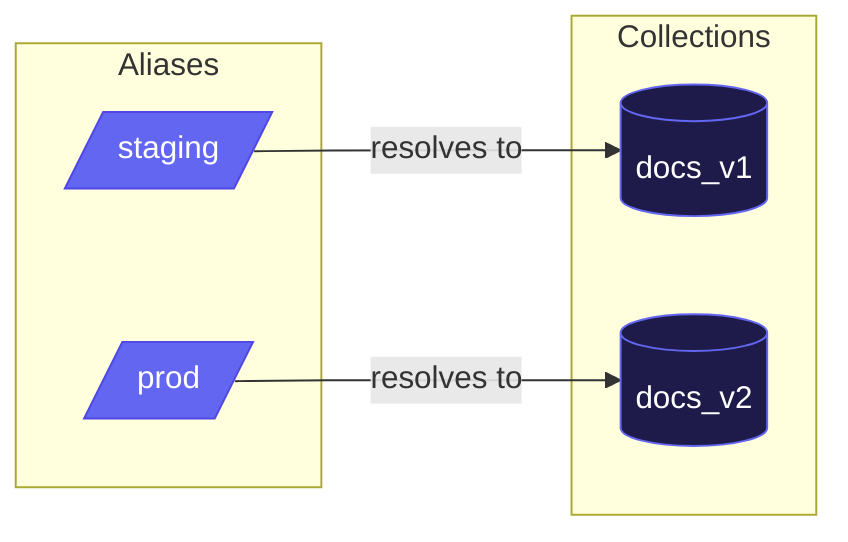

# Collection Aliasing

Aliases provide alternative names for collections, enabling zero-downtime deployments and flexible collection management.

## What Are Aliases?

An alias is a pointer from one name to a collection. When you query using an alias, Needle automatically resolves it to the underlying collection. This indirection enables powerful deployment patterns.



## Use Cases

### Blue-Green Deployments

Deploy a new version of your embeddings without downtime:

```rust
use needle::Database;

let db = Database::open("vectors.needle")?;

// Initial setup: v1 is production
db.create_collection("docs_v1", 384)?;
db.create_alias("prod", "docs_v1")?;

// Your app always queries "prod"
let collection = db.collection("prod")?;
let results = collection.search(&query, 10)?;

// Later: deploy v2
db.create_collection("docs_v2", 384)?;
// ... index new embeddings into docs_v2 ...

// Atomic switch to v2
db.update_alias("prod", "docs_v2")?;

// App immediately uses v2, no restart needed
```

### Environment Separation

Use aliases to separate environments while sharing the same database:

```rust
// Development points to test data
db.create_alias("dev", "docs_test")?;

// Production points to real data
db.create_alias("prod", "docs_production")?;

// Code uses environment variable
let env = std::env::var("ENV").unwrap_or("dev".to_string());
let collection = db.collection(&env)?;
```

### A/B Testing

Route different users to different collection versions:

```rust
fn get_collection<'a>(db: &'a Database, user_id: &str) -> Result<CollectionRef<'a>> {
    let bucket = hash(user_id) % 100;
    let alias = if bucket < 10 { "experiment" } else { "control" };
    db.collection(alias)
}
```

## API Reference

### Creating Aliases

```rust
// Create an alias pointing to a collection
db.create_alias("prod", "docs_v2")?;

// Fails if alias already exists
match db.create_alias("prod", "docs_v3") {
    Err(NeedleError::AliasAlreadyExists(_)) => {
        // Use update_alias instead
        db.update_alias("prod", "docs_v3")?;
    }
    _ => {}
}

// Fails if target collection doesn't exist
db.create_alias("bad", "nonexistent")?; // Error: CollectionNotFound
```

### Updating Aliases

```rust
// Atomically switch an alias to a different collection
db.update_alias("prod", "docs_v3")?;

// Fails if alias doesn't exist
db.update_alias("nonexistent", "docs_v1")?; // Error: AliasNotFound
```

### Deleting Aliases

```rust
// Delete an alias (returns true if it existed)
let deleted = db.delete_alias("old_alias")?;
println!("Deleted: {}", deleted); // true or false

// Deleting non-existent alias returns false (not an error)
assert!(!db.delete_alias("nonexistent")?);
```

### Listing Aliases

```rust
// List all aliases as (alias, collection) tuples
let aliases = db.list_aliases();
for (alias, collection) in aliases {
    println!("{} -> {}", alias, collection);
}

// Get aliases pointing to a specific collection
let aliases = db.aliases_for_collection("docs_v2");
println!("Aliases for docs_v2: {:?}", aliases);
```

### Resolving Aliases

```rust
// Get the canonical collection name for an alias
if let Some(collection_name) = db.get_canonical_name("prod") {
    println!("prod resolves to {}", collection_name);
} else {
    println!("prod is not an alias");
}

// collection() automatically resolves aliases
let coll = db.collection("prod")?; // Works with alias or collection name
```

## Collection Protection

Collections with active aliases cannot be dropped:

```rust
db.create_collection("docs_v1", 384)?;
db.create_alias("prod", "docs_v1")?;

// This fails - collection has aliases
match db.drop_collection("docs_v1") {
    Err(NeedleError::CollectionHasAliases(name)) => {
        println!("Cannot drop {}: has aliases", name);

        // Remove aliases first
        for alias in db.aliases_for_collection("docs_v1") {
            db.delete_alias(&alias)?;
        }

        // Now drop succeeds
        db.drop_collection("docs_v1")?;
    }
    _ => {}
}
```

## CLI Usage

Manage aliases from the command line:

```bash
# Create an alias
needle alias create -d mydb.needle --alias prod --collection docs_v2

# List all aliases
needle alias list -d mydb.needle

# Resolve an alias to its target
needle alias resolve -d mydb.needle --alias prod

# Update an alias to point to a different collection
needle alias update -d mydb.needle --alias prod --collection docs_v3

# Delete an alias
needle alias delete -d mydb.needle --alias prod
```

## REST API

When running Needle as an HTTP server:

```bash
# Create an alias
curl -X POST http://localhost:8080/aliases \
  -H "Content-Type: application/json" \
  -d '{"alias": "prod", "collection": "docs_v2"}'

# List all aliases
curl http://localhost:8080/aliases

# Update an alias
curl -X PUT http://localhost:8080/aliases/prod \
  -H "Content-Type: application/json" \
  -d '{"collection": "docs_v3"}'

# Delete an alias
curl -X DELETE http://localhost:8080/aliases/prod

# Query using an alias (works transparently)
curl -X POST http://localhost:8080/collections/prod/search \
  -H "Content-Type: application/json" \
  -d '{"vector": [0.1, 0.2, ...], "k": 10}'
```

## Best Practices

1. **Use descriptive alias names**: `prod`, `staging`, `experiment_new_model` are better than `a1`, `a2`

2. **Document your aliases**: Keep a record of what each alias means and when it was last updated

3. **Test before switching**: Always verify the new collection works before updating a production alias

4. **Clean up old collections**: After switching aliases, consider dropping old collections to save space

5. **Avoid alias chains**: Aliases cannot point to other aliases—they must point directly to collections

## Next Steps

- [Collections](/docs/concepts/collections) - Learn about collection management
- [TTL/Auto-Expiration](/docs/concepts/ttl) - Automatically expire vectors
- [CLI Reference](/docs/advanced/cli) - Command-line interface
