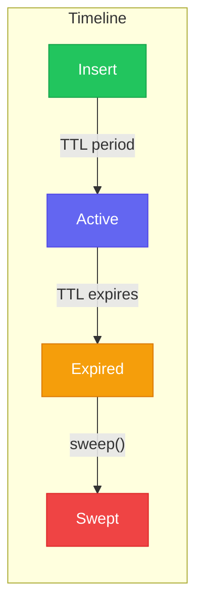

# TTL / Auto-Expiration

Needle supports automatic expiration of vectors based on time-to-live (TTL), useful for caching, session data, and time-sensitive embeddings.

## What is TTL?

TTL (Time-To-Live) specifies how long a vector should exist before it's considered expired. After the TTL period, the vector is automatically excluded from search results and can be permanently removed.



## Use Cases

### Embedding Cache

Cache expensive embeddings with automatic cleanup:

```rust
// Cache embeddings for 1 hour
let one_hour = 60 * 60;
collection.insert_with_ttl("cache:user:123", &embedding, None, Some(one_hour))?;

// Expired entries are automatically filtered from search results
let results = collection.search(&query, 10)?; // Won't return expired vectors
```

### Session Data

Store session-based vectors that expire when sessions end:

```rust
// Session vectors expire after 30 minutes of inactivity
let session_ttl = 30 * 60;
collection.insert_with_ttl(
    &format!("session:{}:query", session_id),
    &query_embedding,
    Some(json!({"user_id": user_id})),
    Some(session_ttl),
)?;
```

### Time-Sensitive Content

Index news or social media content that loses relevance over time:

```rust
// News articles expire after 7 days
let week = 7 * 24 * 60 * 60;
collection.insert_with_ttl(
    &article.id,
    &article.embedding,
    Some(json!({"title": article.title, "published": article.date})),
    Some(week),
)?;
```

### Sliding Window Analytics

Keep only recent data for real-time analytics:

```rust
// Keep only last 24 hours of user activity
let day = 24 * 60 * 60;
collection.insert_with_ttl(
    &format!("activity:{}:{}", user_id, timestamp),
    &activity_embedding,
    Some(json!({"action": action_type})),
    Some(day),
)?;
```

## API Reference

### Inserting with TTL

```rust
// Insert with explicit TTL (in seconds)
collection.insert_with_ttl(
    "doc1",
    &embedding,
    Some(json!({"title": "Hello"})),
    Some(3600), // Expires in 1 hour
)?;

// Insert without TTL (never expires)
collection.insert_with_ttl("doc2", &embedding, None, None)?;
// Or use the standard insert
collection.insert("doc2", &embedding, None)?;
```

### Collection Default TTL

Set a default TTL for all vectors in a collection:

```rust
use needle::CollectionConfig;

// All vectors expire after 1 day by default
let config = CollectionConfig::new("cache", 384)
    .with_default_ttl_seconds(Some(86400));

db.create_collection_with_config("cache", config)?;

// This vector expires in 1 day (uses default)
collection.insert("item1", &embedding, None)?;

// This vector expires in 1 hour (overrides default)
collection.insert_with_ttl("item2", &embedding, None, Some(3600))?;

// This vector never expires (explicitly no TTL)
collection.insert_with_ttl("permanent", &embedding, None, Some(0))?; // 0 = no TTL
```

### Lazy vs Eager Expiration

Needle supports two expiration strategies:

#### Lazy Expiration (Default)

Expired vectors are filtered out at search time but remain in storage:

```rust
// Lazy expiration is enabled by default
let config = CollectionConfig::new("docs", 384)
    .with_lazy_expiration(true);

// Expired vectors are automatically excluded from results
let results = collection.search(&query, 10)?;
```

**Pros:**
- No background processing needed
- Immediate consistency in search results

**Cons:**
- Storage not reclaimed until sweep
- Slightly more filtering at query time

#### Eager Expiration (Sweep)

Explicitly remove expired vectors to reclaim storage:

```rust
// Remove all expired vectors
let removed_count = collection.expire_vectors()?;
println!("Removed {} expired vectors", removed_count);
```

### TTL Statistics

Check the expiration status of your collection:

```rust
let (total, expired, nearest, furthest) = collection.ttl_stats()?;

println!("Total vectors with TTL: {}", total);
println!("Currently expired: {}", expired);

if let Some(nearest) = nearest {
    println!("Next expiration in: {} seconds", nearest - now());
}

if let Some(furthest) = furthest {
    println!("Last expiration in: {} seconds", furthest - now());
}
```

### Checking if Sweep is Needed

```rust
// Check if more than 10% of vectors are expired
if collection.needs_expiration_sweep(0.1)? {
    println!("Consider running expire_vectors()");
    collection.expire_vectors()?;
}
```

## CLI Usage

Manage TTL from the command line:

```bash
# View TTL statistics for a collection
needle ttl stats -d mydb.needle -c documents

# Output:
# TTL Statistics for 'documents':
#   Vectors with TTL: 1,234
#   Currently expired: 56
#   Nearest expiration: 2024-01-15 10:30:00 UTC
#   Furthest expiration: 2024-01-22 15:45:00 UTC

# Sweep expired vectors
needle ttl sweep -d mydb.needle -c documents

# Output:
# Swept 56 expired vectors from 'documents'
```

## REST API

When running Needle as an HTTP server:

```bash
# Insert with TTL
curl -X POST http://localhost:8080/collections/cache/vectors \
  -H "Content-Type: application/json" \
  -d '{
    "id": "item1",
    "vector": [0.1, 0.2, ...],
    "metadata": {"key": "value"},
    "ttl_seconds": 3600
  }'

# Trigger expiration sweep
curl -X POST http://localhost:8080/collections/cache/expire

# Response:
# {"expired_count": 42}
```

## Integration with Compaction

The `compact()` operation automatically runs expiration first:

```rust
// This removes expired vectors AND reclaims space from deletions
collection.compact()?;
```

For large collections, consider running expiration separately:

```rust
// Step 1: Remove expired vectors
let expired = collection.expire_vectors()?;
println!("Expired {} vectors", expired);

// Step 2: Compact to reclaim space (if needed)
if expired > 1000 {
    collection.compact()?;
}
```

## Best Practices

### 1. Choose Appropriate TTL Values

| Use Case | Suggested TTL |
|----------|---------------|
| Request cache | 5-15 minutes |
| Session data | 30-60 minutes |
| Daily analytics | 24 hours |
| Weekly content | 7 days |
| Monthly archives | 30 days |

### 2. Schedule Regular Sweeps

For high-throughput systems, schedule periodic sweeps:

```rust
// In a background task
loop {
    tokio::time::sleep(Duration::from_secs(3600)).await; // Every hour

    for collection_name in db.list_collections()? {
        let collection = db.collection(&collection_name)?;
        if collection.needs_expiration_sweep(0.05)? {
            let count = collection.expire_vectors()?;
            info!("Swept {} vectors from {}", count, collection_name);
        }
    }
}
```

### 3. Monitor TTL Statistics

Track expiration metrics for capacity planning:

```rust
let (total, expired, _, _) = collection.ttl_stats()?;
let expired_ratio = expired as f64 / total.max(1) as f64;

metrics.gauge("needle_vectors_with_ttl", total);
metrics.gauge("needle_vectors_expired", expired);
metrics.gauge("needle_expired_ratio", expired_ratio);
```

### 4. Combine with Aliases for Rotation

Use TTL with aliases for time-based data rotation:

```rust
// Create weekly collections
let week = chrono::Utc::now().format("%Y-W%W").to_string();
let collection_name = format!("events_{}", week);

db.create_collection_with_config(
    &collection_name,
    CollectionConfig::new(&collection_name, 384)
        .with_default_ttl_seconds(Some(14 * 24 * 60 * 60)), // 2 weeks
)?;

// Point alias to current week
db.update_alias("events_current", &collection_name)?;
```

## Performance Considerations

- **Lazy expiration** adds minimal overhead to searches (simple timestamp comparison)
- **Sweep operations** can be expensive for large collections—run during low-traffic periods
- **Storage** is not reclaimed until sweep + compact
- **Memory** for TTL tracking is ~16 bytes per vector with TTL

## Next Steps

- [Collection Aliasing](/docs/concepts/aliasing) - Alternative names for collections
- [Collections](/docs/concepts/collections) - Collection management basics
- [Production Guide](/docs/guides/production) - Deployment best practices
