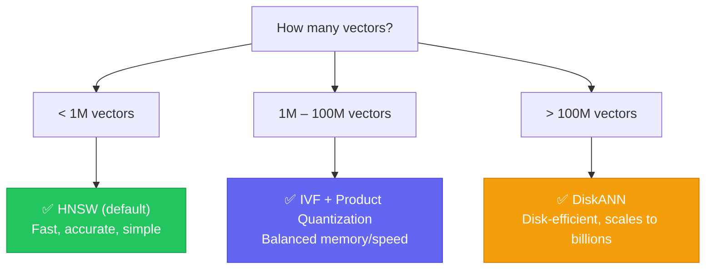

# Index Selection Guide

Choose the right index type for your Needle deployment based on dataset size, performance requirements, and resource constraints.

## Quick Decision Tree



## Index Comparison

| Feature | HNSW | IVF | DiskANN |
|---------|------|-----|---------|
| **Best for** | Small–medium datasets | Large datasets | Huge datasets |
| **Max practical size** | ~50M vectors | ~500M vectors | Billions |
| **Memory per vector** | ~120 bytes | ~40 bytes | ~20 bytes |
| **Query latency (p50)** | 1–5ms | 5–20ms | 10–50ms |
| **Recall@10** | 95–99% | 90–95% | 85–95% |
| **Build time** | Medium | Fast | Slow |
| **Incremental updates** | Yes | Partial | No (rebuild) |
| **Disk-based** | No | Optional | Yes |

---

## HNSW (Hierarchical Navigable Small World)

The default index. Best for datasets that fit in memory with highest recall requirements.

### When to Use

- Dataset fits in memory (&lt; 50M vectors)
- Need highest recall (&gt; 95%)
- Need fast incremental updates
- Low-latency requirements (&lt; 10ms)

### Configuration

```rust
use needle::CollectionConfig;

let config = CollectionConfig::new("collection", 384)
    .with_distance(DistanceFunction::Cosine)
    .with_hnsw_m(16)              // Connections per node (4–64)
    .with_hnsw_ef_construction(200); // Build-time beam width (50–500)

db.create_collection_with_config(config)?;

// At query time, control search accuracy:
collection.search_with_params(&query, 10, None, 50)?; // ef_search = 50
```

### Parameter Tuning

| Parameter | Lower Value | Higher Value |
|-----------|-------------|--------------|
| **M** | Less memory, lower recall | More memory, higher recall |
| **ef_construction** | Faster build, lower recall | Slower build, higher recall |
| **ef_search** | Faster queries, lower recall | Slower queries, higher recall |

#### Recommended Presets

| Use Case | M | ef_construction | ef_search | Recall |
|----------|---|-----------------|-----------|--------|
| **High Recall** | 32 | 400 | 200 | 99%+ |
| **Balanced** (default) | 16 | 200 | 50 | 95% |
| **Low Latency** | 8 | 100 | 20 | 90% |
| **Memory Constrained** | 8 | 100 | 30 | 92% |

### Memory Calculation

```
Memory ≈ N × (D × 4 + M × 8 × 1.5) bytes

Where:
  N = number of vectors
  D = dimensions
  M = HNSW M parameter

Example (1M vectors, 384 dims, M=16):
  1,000,000 × (384 × 4 + 16 × 8 × 1.5) = ~1.7 GB
```

---

## IVF (Inverted File Index)

Clusters vectors into Voronoi cells. At query time, only nearby clusters are searched.

### When to Use

- Dataset too large for HNSW (1M–500M vectors)
- Can tolerate slightly lower recall (90–95%)
- Memory is constrained
- Need faster index builds

### Configuration

```rust
use needle::IvfIndex;

let mut ivf = IvfIndex::new(384, 256); // 384 dimensions, 256 clusters

// Train on a sample (1–10% of dataset)
ivf.train(&sample_vectors)?;

// Add vectors
for (id, vector) in vectors {
    ivf.add(&id, &vector)?;
}
```

### Cluster Count Recommendations

| Dataset Size | n_clusters | n_probe (recall ~95%) |
|--------------|------------|----------------------|
| 1M | 256–1024 | 8–32 |
| 10M | 1024–4096 | 32–64 |
| 100M | 4096–16384 | 64–128 |

---

## DiskANN

Graph-based index that keeps data on disk with in-memory navigation structures.

### When to Use

- Billion-scale datasets
- Memory is severely constrained
- Can tolerate higher latency (10–50ms)
- Index rebuilt periodically (not real-time updates)

:::info Feature Flag
DiskANN requires the `diskann` feature flag:
```toml
needle = { version = "0.1", features = ["diskann"] }
```
:::

---

## Hybrid Approaches

### Quantization + Any Index

Combine quantization with any index type for memory savings:

```rust
use needle::{CollectionConfig, DistanceFunction, QuantizationType};

// HNSW + Scalar Quantization = 4x memory reduction
let config = CollectionConfig::new("collection", 384)
    .with_distance(DistanceFunction::Cosine)
    .with_hnsw_m(16)
    .with_quantization(QuantizationType::Scalar);

db.create_collection_with_config(config)?;
```

| Quantization | Compression | Quality Impact |
|--------------|-------------|----------------|
| Scalar (INT8) | 4x | Minimal (~2% recall loss) |
| Product (PQ) | 8–32x | Moderate (~5% recall loss) |
| Binary | 32x | Higher (~10% recall loss) |

---

## Auto-Tuning

Let Needle automatically select parameters for your workload:

```rust
use needle::{auto_tune, TuningConstraints, PerformanceProfile};

let constraints = TuningConstraints::new(1_000_000, 384)
    .with_profile(PerformanceProfile::HighRecall)
    .with_memory_budget(4 * 1024 * 1024 * 1024); // 4GB

let result = auto_tune(&constraints);
println!("Recommended config: {:?}", result.config);
println!("Expected recall: {:.1}%", result.expected_recall * 100.0);
```

### Performance Profiles

| Profile | Optimizes For | Typical Use Case |
|---------|--------------|------------------|
| `HighRecall` | Accuracy (&gt;99%) | Legal, medical, compliance |
| `Balanced` | Recall/latency trade-off | General search |
| `LowLatency` | Speed (&lt;5ms) | Real-time recommendations |
| `MemoryConstrained` | Memory efficiency | Edge devices, containers |

---

## Troubleshooting

### Low Recall

1. **HNSW**: Increase `ef_search` (try 100–200)
2. **IVF**: Increase `n_probe` (try doubling)
3. Check if vectors are normalized (for cosine distance)
4. Profile with `search_explain()` to find bottleneck

### High Latency

1. **HNSW**: Decrease `ef_search`, add quantization
2. **IVF**: Decrease `n_probe`, add PQ compression
3. Enable SIMD: `features = ["simd"]`

### Out of Memory

1. Enable quantization (Scalar: 4x, PQ: 8–32x, Binary: 32x)
2. Switch to IVF or DiskANN
3. Reduce HNSW `M` parameter

## See Also

- [HNSW Tuning](/docs/configuration/hnsw-tuning) — Detailed parameter tuning
- [Quantization Guide](/docs/guides/quantization) — Compression options
- [Performance & Benchmarks](/docs/benchmarks) — Benchmark methodology
