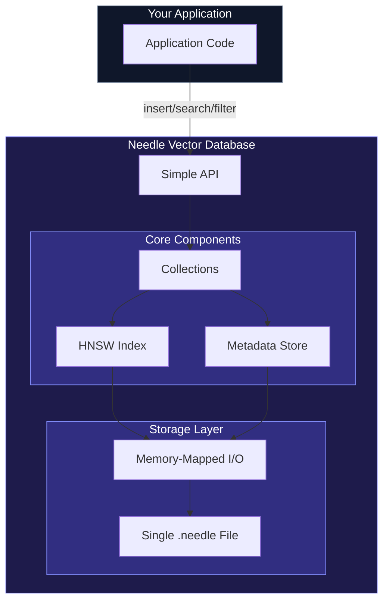

# Introduction

**Needle** is an embedded vector database written in Rust, designed to be the "SQLite for vectors." It provides high-performance approximate nearest neighbor (ANN) search with a simple, intuitive API and zero configuration required.

## Why Needle?

Building AI applications often requires storing and searching vector embeddings efficiently. While there are many vector databases available, most are either:

- **Too heavy**: Require running separate servers, complex configuration, or cloud dependencies
- **Too slow**: Simple implementations that don't scale beyond toy datasets
- **Too limited**: Missing essential features like metadata filtering or hybrid search

Needle fills the gap by providing:

- **Embedded architecture**: Just add the dependency—no servers to manage
- **Single-file storage**: Your entire database in one file, easy to backup and distribute
- **High performance**: HNSW indexing with sub-10ms search latency
- **Rich features**: Metadata filtering, hybrid search, quantization, and more

## Architecture Overview



Needle's embedded architecture means your application links directly to the database—no network calls, no separate processes. All data is stored in a single `.needle` file that you can easily backup, copy, or distribute.

## Key Features

### Core Capabilities

- **HNSW Index**: Hierarchical Navigable Small World graph for O(log n) approximate nearest neighbor search
- **Multiple Distance Functions**: Cosine, Euclidean, Dot Product, and Manhattan
- **Metadata Filtering**: MongoDB-style query syntax for filtering results
- **Hybrid Search**: Combine vector similarity with BM25 text search using RRF fusion

### Performance

- **SIMD Optimization**: Hardware-accelerated distance computations
- **Memory Mapping**: Efficient handling of large datasets without loading everything into RAM
- **Batch Operations**: Process multiple vectors in parallel with Rayon
- **Auto-Tuning**: Automatically configure HNSW parameters for your workload

### Memory Efficiency

- **Scalar Quantization**: Reduce memory usage by 4x
- **Product Quantization**: Up to 32x compression for large-scale deployments
- **Binary Quantization**: Fastest search with 32x compression

### Production Ready

- **HTTP REST API**: Optional server mode for multi-language access
- **Prometheus Metrics**: Built-in observability
- **Comprehensive CLI**: Manage databases from the command line
- **Multi-Language Bindings**: Rust, Python, JavaScript/WASM, Swift, and Kotlin

## Quick Example

```rust
use needle::Database;
use serde_json::json;

fn main() -> needle::Result<()> {
    // Create or open a database
    let db = Database::open("my_vectors.needle")?;

    // Create a collection with 384 dimensions (e.g., for all-MiniLM-L6-v2 embeddings)
    db.create_collection("documents", 384)?;

    // Get a reference to the collection
    let collection = db.collection("documents")?;

    // Insert a vector with metadata
    let embedding: Vec<f32> = get_embedding("Hello, world!");
    collection.insert(
        "doc1",
        &embedding,
        Some(json!({
            "title": "Hello World",
            "category": "greeting"
        }))
    )?;

    // Search for similar vectors
    let query = get_embedding("Hi there!");
    let results = collection.search(&query, 10)?;

    for result in results {
        println!("ID: {}, Distance: {}", result.id, result.distance);
    }

    // Save changes
    db.save()?;

    Ok(())
}
```

## Use Cases

Needle is designed for applications that need fast, reliable vector search:

- **Semantic Search**: Build search engines that understand meaning, not just keywords
- **RAG Applications**: Store and retrieve context for retrieval-augmented generation
- **Recommendation Systems**: Find similar items, users, or content
- **Image/Audio Search**: Search multimedia using embeddings from CLIP, ImageBind, etc.
- **Anomaly Detection**: Find outliers by measuring vector distances
- **Deduplication**: Identify near-duplicate content

## Comparison with Other Solutions

| Feature | Needle | SQLite + Extensions | Pinecone | Qdrant |
|---------|--------|---------------------|----------|--------|
| Embedded | Yes | Yes | No | No |
| Single File | Yes | Yes | No | No |
| HNSW Index | Yes | Limited | Yes | Yes |
| Metadata Filtering | Yes | SQL | Yes | Yes |
| Hybrid Search | Yes | Manual | Yes | Yes |
| Quantization | Yes | No | Yes | Yes |
| Free & Open Source | Yes | Yes | No | Yes |

## Getting Started

Ready to build? Check out the [Getting Started](/docs/getting-started) guide to install Needle and build your first vector search application.

## Documentation Resources

| Resource | Description |
|----------|-------------|
| [Getting Started](/docs/getting-started) | Install Needle and build your first app |
| [Core Concepts](/docs/concepts/vectors) | Understand vectors, collections, and indexing |
| [Guides](/docs/guides/semantic-search) | Step-by-step tutorials for common use cases |
| [Performance & Benchmarks](/docs/benchmarks) | Detailed benchmarks and tuning tips |
| [Migration Guide](/docs/migration) | Migrate from Chroma, Qdrant, Pinecone, and more |
| [Troubleshooting](/docs/troubleshooting) | Solutions to common issues |
| [API Reference](/docs/api-reference) | Complete API documentation |
